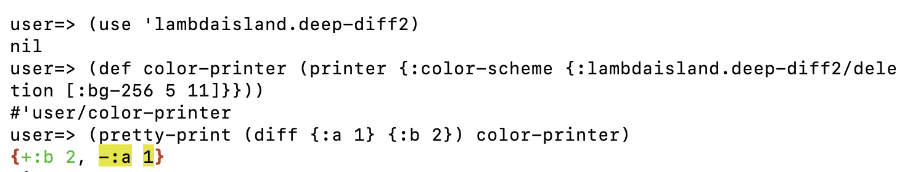

# lambdaisland/deep-diff2

<!-- badges -->
[](https://circleci.com/gh/lambdaisland/deep-diff2) [](https://cljdoc.org/d/lambdaisland/deep-diff2) [](https://clojars.org/lambdaisland/deep-diff2)
<!-- /badges -->

Recursively compare Clojure or ClojureScript data structures, and produce a colorized diff of the result.


Deep-diff2 is foremost intended for creating visual diffs for human consumption,
if you want to programatically diff/patch Clojure data structures then
[Editscript](https://github.com/juji-io/editscript) may be a better fit, see
[this write-up by Huahai Yang](https://juji.io/blog/comparing-clojure-diff-libraries/).

<!-- opencollective -->
## Lambda Island Open Source

Thank you! deep-diff2 is made possible thanks to our generous backers. [Become a
backer on OpenCollective](https://opencollective.com/lambda-island) so that we
can continue to make deep-diff2 better.

<a href="https://opencollective.com/lambda-island">


</a>


&nbsp;

deep-diff2 is part of a growing collection of quality Clojure libraries created and maintained
by the fine folks at [Gaiwan](https://gaiwan.co).

Pay it forward by [becoming a backer on our OpenCollective](http://opencollective.com/lambda-island),
so that we continue to enjoy a thriving Clojure ecosystem.

You can find an overview of all our different projects at [lambdaisland/open-source](https://github.com/lambdaisland/open-source).

&nbsp;

&nbsp;
<!-- /opencollective -->

## Installation

deps.edn

```
lambdaisland/deep-diff2 {:mvn/version "2.11.216"}
```

project.clj

```
[lambdaisland/deep-diff2 "2.11.216"]
```

## Use

- [API docs](https://cljdoc.org/d/lambdaisland/deep-diff2/CURRENT)

``` clojure
(require '[lambdaisland.deep-diff2 :as ddiff])

(ddiff/pretty-print (ddiff/diff {:a 1 :b 2} {:a 1 :c 3}))
```

### Diffing

`lambdaisland.deep-diff2/diff` takes two arguments and returns a "diff", a data
structure that contains markers for insertions, deletions, or mismatches. These
are records with `-` and `+` fields.

``` clojure
(ddiff/diff {:a 1 :b 2} {:a 1 :b 3})
{:a 1, :b #lambdaisland.deep_diff.diff.Mismatch{:- 2, :+ 3}}
```

### Printing

You can pass this diff to `lambdaisland.deep-diff2/pretty-print`. This function
uses [Puget](https://github.com/greglook/puget) and
[Fipp](https://github.com/brandonbloom/fipp) to format the diff and print the
result to standard out.

For fine grained control you can create a custom Puget printer, and supply it to
`pretty-print`.

``` clojure
(def narrow-printer (ddiff/printer {:width 10}))

(ddiff/pretty-print (ddiff/diff {:a 1 :b 2} {:a 1 :b 3}) narrow-printer)
```

For more advanced uses like incorporating diffs into your own Fipp documents, see `lambdaisland.deep-diff2.printer/format-doc`, `lambdaisland.deep-diff2.printer/print-doc`.

### Minimizing

If you are only interested in the changes, and not in any values that haven't
changed, then you can use `ddiff/minimize` to return a more compact diff.

This is especially useful for potentially large nested data structures, for
example a JSON response coming from a web service.

```clj
(-> (ddiff/diff {:a "apple" :b "pear"} {:a "apple" :b "banana"})
    ddiff/minimize
    ddiff/pretty-print)
;; {:b -"pear" +"banana"}
```

### Print handlers for custom or built-in types

In recent versions deep-diff2 initializes its internal copy of Puget with
`{:print-fallback :print}`, meaning it will fall back to using the system
printer, which you can extend by extending the `print-method` multimethod.

This also means that we automatically pick up additional handlers installed by
libraries, such as [time-literals](https://github.com/henryw374/time-literals).

You can also register print handlers for deep-diff2 specifically by using
`lambdaisland.deep-diff2.printer-impl/register-print-handler!`, or by passing an
`:extra-handlers` map to `printer`.

If you are dealing with printing of custom types you might find that there are
multiple print implementations you need to keep up-to-date, see
[lambdaisland.data-printers](https://github.com/lambdaisland/data-printers) for
a high-level API that can work with all the commonly used print implementations.

#### Example of a custom type

See [repl_sessions/custom_type.clj](repl_sessions/custom_type.clj) for the full
code and results.

```clj
(deftype Degrees [amount unit]
  Object
  (equals [this that]
    (and (instance? Degrees that)
         (= amount (.-amount that))
         (= unit (.-unit that)))))

;; Using system handler fallback
(defmethod print-method Degrees [degrees out]
  (.write out (str (.-amount degrees) "°" (.-unit degrees))))
  
;; OR Using a Puget-specific handler
(lambdaisland.deep-diff2.printer-impl/register-print-handler!
 `Degrees
 (fn [printer value]
   [:span
    (lambdaisland.deep-diff2.puget.color/document printer :number (str (.-amount value)))
    (lambdaisland.deep-diff2.puget.color/document printer :tag "°")
    (lambdaisland.deep-diff2.puget.color/document printer :keyword (str (.-unit value)))]))
```

### Set up a custom print handler with different colors by utilizing Puget library

Sometimes, we need to tune the colors to:

- Ensure adequate contrast on a different background.
- Ensure readability by people who are colorblind.
- Match your editor or main diff tool's color scheme.

#### Config of Puget

Fortunately, the Puget library included in deep-diff2 already allows customization through a custom printer. 

In the Puget libray, 8-bit scheme is expressed via `[:fg-256 5 n]` where n is between 0 and 255. We can combine foreground and background, for example, like so: `[:fg-256 5 226 :bg-256 5 56]`.

24-bit scheme is expressed via `[:fg-256 2 r g b]` where r g b are each between 0 and 255. Foreground and background can be combined, for example: `[:fg-256 2 205 236 255 :bg-256 2 110 22 188]`.

#### An example of customizing color

For example, if we change the `:lambdaisland.deep-diff2.printer-impl/deletion` from `[:red]` to  `[:bg-256 5 13]`, the color code it outputs will change from `\u001b[31m` to `\u001b[48;5;13m`

```
user=> (use 'lambdaisland.deep-diff2)
nil
user=> (def color-printer (printer {:color-scheme {:lambdaisland.deep-diff2.printer-impl/deletion [:bg-256 5 13]}}))
#'user/color-printer
user=> (pretty-print (diff {:a 1} {:b 2}) color-printer)
{+:b 2, -:a 1}
```

That results in the following highlighting:


### Time, data literal

A common use case is diffing and printing Java date and time objects
(`java.util.Date`, `java.time.*`, `java.sql.Date|Time|DateTime`).

Chances are you already have print handlers (and data readers) set up for these
via the [time-literals](https://github.com/henryw374/time-literals) library
(perhaps indirectly by pulling in [tick](https://github.com/juxt/tick). In that
case these should _just work_.

```clj
(ddiff/diff #inst "2019-04-09T14:57:46.128-00:00"
            #inst "2019-04-10T14:57:46.128-00:00")
```
or
```clj
(import '[java.sql Timestamp])
(ddiff/diff (Timestamp. 0)
            (doto (Timestamp. 1000) (.setNanos 101)))
```

If you need to diff a rich set of time literal, using

```
(require '[time-literals.read-write])
(require '[lambdaisland.deep-diff2 :as ddiff])
(time-literals.read-write/print-time-literals-clj!)
(ddiff/pretty-print (ddiff/diff #time/date "2039-01-01" #time/date-time "2018-07-05T08:08:44.026"))
```

## Deep-diff 1 vs 2

The original deep-diff only worked on Clojure, not ClojureScript. In porting the
code to CLJC we were forced to make some breaking changes. To not break existing
consumers we decided to move both the namespaces and the released artifact to
new names, so the old and new deep-diff can exist side by side.

We also had to fork Puget to make it cljc compatible. This required breaking
changes as well, making it unlikely these changes will make it upstream, so
instead we vendor our own copy of Puget under `lambdaisland.deep-diff2.puget.*`.
This does mean we don't automatically pick up custom Puget print handlers,
unless they are *also* registered with our own copy of Puget. See above for more
info on that.

When starting new projects you should use `lambdaisland/deep-diff2`. However if
you have existing code that uses `lambdaisland/deep-diff` and you don't need the
ClojureScript support then it is not necessary to upgrade. The old version still
works fine (on Clojure).

You can upgrade of course, simply by replacing all namespace names from
`lambdaisland.deep-diff` to `lambdaisland.deep-diff2`. If you are only using the
top-level API (`diff`, `printer`, `pretty-print`) and you aren't using custom
print handlers, then things should work exactly the same. If you find that
deep-diff 2 behaves differently then please file an issue, you may have found a
regression.

The old code still lives on the `deep-diff-1` branch, and we do accept bugfix
patches there, so we may put out bugfix releases of the original deep-diff in
the future. When in doubt check the CHANGELOG.

<!-- contributing -->
## Contributing

We warmly welcome patches to deep-diff2. Please keep in mind the following:

- adhere to the [LambdaIsland Clojure Style Guide](https://nextjournal.com/lambdaisland/clojure-style-guide)
- write patches that solve a problem 
- start by stating the problem, then supply a minimal solution `*`
- by contributing you agree to license your contributions as EPL 1.0
- don't break the contract with downstream consumers `**`
- don't break the tests

We would very much appreciate it if you also

- update the CHANGELOG and README
- add tests for new functionality

We recommend opening an issue first, before opening a pull request. That way we
can make sure we agree what the problem is, and discuss how best to solve it.
This is especially true if you add new dependencies, or significantly increase
the API surface. In cases like these we need to decide if these changes are in
line with the project's goals.

`*` This goes for features too, a feature needs to solve a problem. State the problem it solves first, only then move on to solving it.

`**` Projects that have a version that starts with `0.` may still see breaking changes, although we also consider the level of community adoption. The more widespread a project is, the less likely we're willing to introduce breakage. See [LambdaIsland-flavored Versioning](https://github.com/lambdaisland/open-source#lambdaisland-flavored-versioning) for more info.
<!-- /contributing -->

## Credits

This library builds upon
[clj-diff](https://github.com/brentonashworth/clj-diff), which implements a
diffing algorithm for sequences, and
[clj-arrangements](https://github.com/greglook/clj-arrangement), which makes
disparate types sortable.

Pretty printing and colorization are handled by
[Puget](https://github.com/greglook/puget) and
[Fipp](https://github.com/brandonbloom/fipp).

This library was originally developed as part of the
[Kaocha](https://github.com/lambdaisland/kaocha) test runner.

Another library that implements a form of data structure diffing is [editscript](https://github.com/juji-io/editscript).

<!-- license -->
## License

Copyright &copy; 2018-2024 Arne Brasseur and contributors

Available under the terms of the Eclipse Public License 1.0, see LICENSE.txt
<!-- /license -->