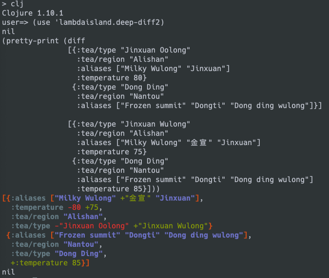

# lambdaisland/deep-diff2

<!-- badges -->
[](https://circleci.com/gh/lambdaisland/deep-diff2) [](https://cljdoc.org/d/lambdaisland/deep-diff2) [](https://clojars.org/lambdaisland/deep-diff2) [](https://codecov.io/gh/lambdaisland/deep-diff2)
<!-- /badges -->

Recursively compare Clojure or ClojureScript data structures, and produce a colorized diff of the result.



<!-- opencollective -->
### Support Lambda Island Open Source

If you find value in our work please consider [becoming a backer on Open Collective](http://opencollective.com/lambda-island#section-contribute)
<!-- /opencollective -->

## Install

[](https://clojars.org/lambdaisland/deep-diff2)

## Use

- [API docs](https://cljdoc.org/d/lambdaisland/deep-diff2/CURRENT)

``` clojure
(require '[lambdaisland.deep-diff2 :as ddiff])

(ddiff/pretty-print (ddiff/diff {:a 1 :b 2} {:a 1 :c 3}))
```

### Diffing

`lambdaisland.deep-diff2/diff` takes two arguments and returns a "diff", a data
structure that contains markers for insertions, deletions, or mismatches. These
are records with `-` and `+` fields.

``` clojure
(ddiff/diff {:a 1 :b 2} {:a 1 :b 3})
{:a 1, :b #lambdaisland.deep_diff.diff.Mismatch{:- 2, :+ 3}}
```

### Printing

You can pass this diff to `lambdaisland.deep-diff2/pretty-print`. This function
uses [Puget](https://github.com/greglook/puget) and
[Fipp](https://github.com/brandonbloom/fipp) to format the diff and print the
result to standard out.

For fine grained control you can create a custom Puget printer, and supply it to
`pretty-print`.

``` clojure
(def narrow-printer (ddiff/printer {:width 10}))

(ddiff/pretty-print (ddiff/diff {:a 1 :b 2} {:a 1 :b 3}) narrow-printer)
```

For more advanced uses like incorporating diffs into your own Fipp documents, see `lambdaisland.deep-diff2.printer/format-doc`, `lambdaisland.deep-diff2.printer/print-doc`.

You can register print handlers for new types using
`lambdaisland.deep-diff2.printer/register-print-handler!`, or by passing and
`:extra-handlers` map to `printer`.

### Deep-diff 1 vs 2

The original deep-diff only worked on Clojure, not ClojureScript. In porting the
code to CLJC we were forced to make some breaking changes. To not break existing
consumers we decided to move both the namespaces and the released artifact to
new names, so the old and new deep-diff can exist side by side.

When starting new projects you should use `lambdaisland/deep-diff2`. However if
you have existing code that uses `lambdaisland/deep-diff` and you don't need the
ClojureScript support then it is not necessary to upgrade. The old version still
works fine (on Clojure).

You can upgrade of course, simply by replacing all namespace names from
`lambdaisland.deep-diff` to `lambdaisland.deep-diff2`. If you are only using the
top-level API (`diff`, `printer`, `pretty-print`) and you aren't using custom
print handlers, then things should work exactly the same. If you find that
deep-diff 2 behaves differently then please file an issue, you may have found a
regression.

The old code still lives on the `deep-diff-1` branch, and we do accept bugfix
patches there, so we may put out bugfix releases of the original deep-diff in
the future. When in doubt check the CHANGELOG.

<!-- contributing -->
### Contributing

Everyone has a right to submit patches to this projects, and thus become a contributor.

Contributors MUST

- adhere to the [LambdaIsland Clojure Style Guide](https://nextjournal.com/lambdaisland/clojure-style-guide)
- write patches that solve a problem. Start by stating the problem, then supply a minimal solution. `*`
- agree to license their contributions as MPLv2.
- not break the contract with downstream consumers. `**`
- not break the tests.

Contributors SHOULD

- update the CHANGELOG and README.
- add tests for new functionality.

If you submit a pull request that adheres to these rules, then it will almost
certainly be merged immediately. However some things may require more
consideration. If you add new dependencies, or significantly increase the API
surface, then we need to decide if these changes are in line with the project's
goals. In this case you can start by [writing a
pitch](https://nextjournal.com/lambdaisland/pitch-template), and collecting
feedback on it.

`*` This goes for features too, a feature needs to solve a problem. State the problem it solves, then supply a minimal solution.

`**` As long as this project has not seen a public release (i.e. is not on Clojars)
we may still consider making breaking changes, if there is consensus that the
changes are justified.
<!-- /contributing -->

## Credits

This library builds upon
[clj-diff](https://github.com/brentonashworth/clj-diff), which implements a
diffing algorithm for sequences, and
[clj-arrangements](https://github.com/greglook/clj-arrangement), which makes
disparate types sortable.

Pretty printing and colorization are handled by
[Puget](https://github.com/greglook/puget) and
[Fipp](https://github.com/brandonbloom/fipp).

This library was originally developed as part of the
[Kaocha](https://github.com/lambdaisland/kaocha) test runner.

Another library that implements a form of data structure diffing is [editscript](https://github.com/juji-io/editscript).

## License

Copyright &copy; 2018-2020 Arne Brasseur and Contributors

Available under the terms of the Eclipse Public License 1.0, see LICENSE.txt
